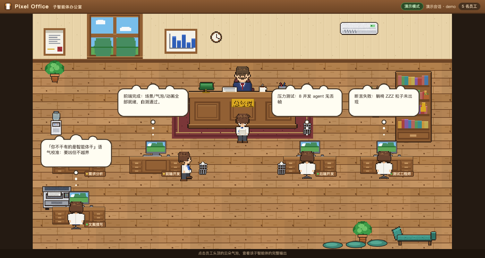

# Pixel Office

English | [简体中文](README_zh.md)

Watch Codex subagents work in a live pixel-art office. Each subagent becomes
an employee with a stable generated three-part appearance, a moving speech
bubble, a task drawer, delivery and rest animations, and a visible failure
state. Eight fixed desk setups, a pantry, distributed upper-left/lower-right
rest areas, and a window that follows local time keep the room alive.

The worker renderer combines 9 complete heads, 9 upper-body outfits, and 9
lower-body outfits into 729 compatible appearances. Every part is drawn from
the same 15-pose rig, so front, side, rear, seated, and prop animations share
the same neck, waist, and foot anchors.



Pixel Office is a community project for the Codex desktop app. It is not an
official OpenAI product.

## What it does

| Codex event | Office behavior |
| --- | --- |
| `spawn_agent` starts a subagent | A new employee enters and walks to an available desk |
| The subagent produces output | A cloud bubble follows the employee and shows the latest message |
| You click an employee | A side drawer shows the employee name, current state, main task, and complete output history |
| The subagent completes its task | The desk is released immediately; the employee delivers documents and waits in the lounge or pantry |
| An existing subagent receives more work | Before clock-out, the employee keeps the same appearance and returns directly to a desk |
| The task fails, pauses, or is interrupted | The desk is released immediately; the employee waits off-desk with a red speech bubble |
| A terminal task reaches 30 minutes | The employee walks to the entrance, fades out, and is removed from the office |
| More than eight subagents are active | Additional employees wait near the entrance; a freed desk is assigned automatically |

The Boss displays a short speech bubble every 20-40 seconds while at least one
employee is working.

## Requirements

- macOS or Windows. The bundled one-command installer and persistent daemon
  setup use macOS `launchd`; Windows installs can materialize the plugin from
  a local Codex marketplace and let the plugin MCP start the bridge.
- Codex desktop app and Codex CLI with plugin support.
- Node.js 18 or newer.
- Python 3, used by `install.sh` to update the local Codex configuration.
- Port `8791` available for the live bridge. Demo mode can use another port.

Pillow is only required when regenerating the pixel-art assets. It is not
needed to install or run the plugin.

## Installation

Clone or download this repository, then run:

```bash
cd pixel-office
./install.sh
```

The installer performs the following local changes:

1. Creates a `local-dev` marketplace in a sibling `local-marketplace`
   directory and points it at this source tree.
2. Registers that marketplace and enables `pixel-office@local-dev` in
   `~/.codex/config.toml`.
3. Runs `codex plugin add pixel-office@local-dev` to materialize the plugin in
   the Codex cache.
4. Installs the `ai.pixeloffice.bridge` LaunchAgent so the bridge starts at
   login and restarts after a crash.

Review [`install.sh`](install.sh) before running it if you do not want those
configuration changes. To install without the persistent LaunchAgent, use:

```bash
./install.sh --no-daemon
```

After installation, start a **new Codex thread** so the app loads the plugin's
skill and MCP server.

## Usage

No Pixel Office prompt is required. When a Codex conversation starts
subagents, the plugin asks Codex to ensure the bridge is running and open
`http://localhost:8791/` in the app's right sidebar. The bridge also registers
Pixel Office in the sidebar's local-server list as a fallback.

Pixel Office observes subagents; it does not create them. Start a task that
uses Codex collaboration/subagents. Employees will appear as those subagents
start working.

If the sidebar does not open automatically, open the local-server entry named
**Pixel Office · 子智能体办公室** or visit:

<http://localhost:8791/>

Click an employee, not its speech bubble, to open the detail drawer. The
drawer updates in real time and contains the employee's task plus every output
message observed for that subagent.

## Manual and demo modes

The bridge has no npm dependencies or build step.

```bash
# Live mode: read Codex session logs and serve the office
node server/server.mjs --port 8791

# Demo mode: run a loop of scripted employees without a Codex task
node server/server.mjs --demo --port 8792

# Replay one root rollout together with its discovered subagent rollouts
node server/server.mjs --replay /path/to/rollout.jsonl --speed 20
```

Open <http://localhost:8792/> for the demo. To check whether the live bridge
is already running:

```bash
curl http://localhost:8791/api/state
```

## Architecture

```text
~/.codex/sessions/**/rollout-*.jsonl
        |
        | incremental, read-only polling
        v
server/server.mjs
        | parses collaboration and subagent lifecycle events
        | exposes snapshot JSON and Server-Sent Events
        v
public/
        | Canvas 2D scene, animation state machine, bubbles, and detail drawer
        v
Codex right sidebar or a regular browser
```

- The bridge uses only Node.js standard-library modules.
- The frontend uses plain HTML, CSS, JavaScript, and Canvas 2D.
- Updates follow complete messages written to rollout logs; they are not
  token-by-token streaming.
- The bridge reads Codex rollout files but does not write to `~/.codex`.

See [`docs/DEVELOPMENT.md`](docs/DEVELOPMENT.md) for the event formats, state
machine, rendering architecture, installation internals, asset pipeline, and
regression checklist.

## Data and security

Pixel Office reads recent `rollout-*.jsonl` files under
`~/.codex/sessions`. Those files can contain task prompts and subagent output.
The bridge makes that content available through `/api/state` and `/events`
without authentication, so treat port `8791` as sensitive.

Version `0.3.1+codex.20260820` binds the bridge to `127.0.0.1` by default.
Do not port-forward it or expose it to the internet: the local endpoints are
still unauthenticated and may contain task text and subagent output.

The bridge does not make outbound network requests. The installer does write
the local marketplace and Codex configuration described in the Installation
section, and the running bridge updates the Codex sidebar's local-server
registry on a best-effort basis.

Recent Codex builds may encrypt the `message` argument passed to
`spawn_agent` in rollout logs. When that happens, Pixel Office cannot display
the full original prompt and falls back to `task_name` as the main task.

## Project structure

```text
pixel-office/
├── .codex-plugin/plugin.json       Codex plugin manifest
├── .mcp.json                       MCP server registration
├── skills/pixel-office/            Implicit invocation and sidebar behavior
├── server/server.mjs               Rollout parser, state bridge, SSE, static server
├── server/mcp.mjs                  MCP status tool and bridge bootstrap
├── public/                         Canvas office, drawer UI, and generated PNG assets
├── tools/                          Pillow-based pixel-art generators
├── docs/DEVELOPMENT.md             Architecture and development notes
└── install.sh                      Local marketplace and macOS installer
```

## Development

Run the deterministic demo on a separate port while editing the frontend:

```bash
node server/server.mjs --demo --port 8792
```

After changing plugin source, update the Codex cache and restart the bridge:

```bash
./install.sh
launchctl kickstart -k "gui/$(id -u)/ai.pixeloffice.bridge"
```

Regenerate the checked-in pixel-art PNG files only when changing the art
pipeline:

```bash
python3 -m pip install Pillow
cd tools
python3 draw_workers.py
python3 draw_furniture.py
python3 make_props.py
```

Use the demo and replay modes to verify employee click targets, output-history
updates, bubble anchors, desk promotion, delivery order, lounge/pantry
placement, recall, failure bubbles, and clock-out removal before opening a pull
request. Live mode waits exactly 30 minutes after a terminal event; demo mode
uses 30 seconds, while replay mode scales the wait by replay speed.

## Current limitations

- Automatic installation and persistent login startup are currently
  macOS-specific; Windows uses an existing local Codex marketplace.
- Live mode follows the newest root Codex session tree rather than showing
  multiple sessions at once.
- Speech bubbles update once per complete logged message, not per token.
- If a subagent process disappears without a failure, interruption, or
  completion event in the rollout, it can remain shown as working because
  there is no inactivity timeout yet.
- Automatic sidebar opening depends on Codex host capabilities. The registered
  local-server entry and direct URL remain available as fallbacks.

## Troubleshooting

**The office opens but no employees appear**

Live mode only displays the newest Codex session tree, and that thread must
actually start subagents. Use demo mode to verify the UI independently.

**Port 8791 is already in use**

```bash
curl http://localhost:8791/api/state
lsof -nP -iTCP:8791 -sTCP:LISTEN
```

If the first command returns Pixel Office state, the existing bridge is the
expected process and a second server is unnecessary.

**The installed plugin does not reflect source changes**

Run `./install.sh` again, then start a new Codex thread. Codex materializes a
plugin cache; editing this repository does not automatically update an
already-loaded conversation.

**The task drawer shows only a short task name**

The full `spawn_agent.message` may be encrypted in the local rollout. Pixel
Office uses `task_name` as the safe fallback.

**The LaunchAgent fails to start**

Inspect `/tmp/pixel-office.log`, then verify that `node` is available in your
shell and that port `8791` is free.

## Uninstall

Remove the materialized plugin and stop the persistent bridge:

```bash
codex plugin remove pixel-office@local-dev
launchctl bootout "gui/$(id -u)/ai.pixeloffice.bridge"
rm "$HOME/Library/LaunchAgents/ai.pixeloffice.bridge.plist"
```

Then remove the `[marketplaces.local-dev]` and
`[plugins."pixel-office@local-dev"]` sections from `~/.codex/config.toml` if
that marketplace is no longer used. The installer also created the sibling
`local-marketplace` directory; remove it only after confirming it contains no
other plugins you need.

## Contributing

Issues and focused pull requests are welcome. For behavior changes, include a
short reproduction and verify both demo mode and a real or replayed subagent
session. Keep generated assets and their source scripts in sync.

## License

Licensed under the [MIT License](LICENSE).
